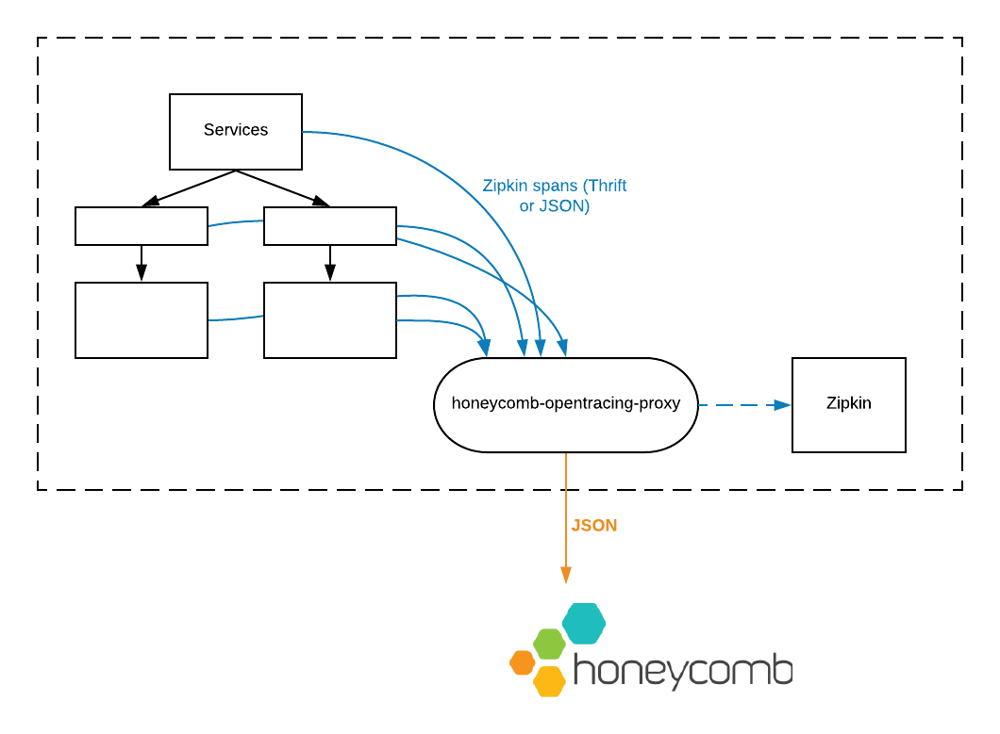

[](https://circleci.com/gh/honeycombio/honeycomb-opentracing-proxy)

`honeycomb-opentracing-proxy` is a drop-in compatible replacement for Zipkin.
If your services are instrumented with OpenTracing and emit span data using
Zipkin's Thrift or JSON formats, then `honeycomb-opentracing-proxy` can receive that data
and forward it to the [Honeycomb](https://honeycomb.io) API. Using Honeycomb,
you can explore single traces, and run queries over aggregated trace data.



## Getting Started

First, [sign up](https://honeycomb.io/signup) for a free Honeycomb trial
account, and grab your write key from your [account page](https://ui.honeycomb.io/account).

### Installation

If you have Go installed, you can clone this repository and build the
proxy using the commands below. Alternatively, a [Docker image](https://hub.docker.com/r/honeycombio/honeycomb-opentracing-proxy)
is available. Binary, deb and RPM package downloads will be available soon!

```
git clone git@github.com:honeycombio/honeycomb-opentracing-proxy \
    $GOPATH/src/github.com/honeycombio/honeycomb-opentracing-proxy
go install github.com/honeycombio/honeycomb-opentracing-proxy/...
```

### Usage

```
# Forward spans to a Honeycomb dataset named `traces`, using writekey $WRITEKEY
honeycomb-opentracing-proxy -d traces -k $WRITEKEY

# Forward spans to a downstream "real" Zipkin collector as well
honeycomb-opentracing-proxy --downstream https://myzipkin.example.com:9411

# Write spans to stdout for debugging or local development
honeycomb-opentracing-proxy --debug
```

If you're using Kubernetes, you can find a sample deployment manifest in the
[kubernetes/](/kubernetes) directory.

### Advanced usage

If you're instrumenting a complex codebase, and you'd like to send different
_types_ of traces to different Honeycomb datasets, add a `honeycomb.dataset`
tag to your spans. E.g.

```
span, ctx := opentracing.StartSpan("myNewSpan")
span.SetTag("honeycomb.dataset", "My Shiny Tracing Dataset")
```

### Using with a corporate/internal proxy server

If your outbound HTTP traffic goes through an internal/corporate proxy server, you might need to specify the `HTTPS_PROXY` environment variable when running the OpenTracing proxy:

```
HTTPS_PROXY=<my proxy address>
```

## Looking to contribute?

Please see our [development guide](./DEVELOPMENT.MD)
